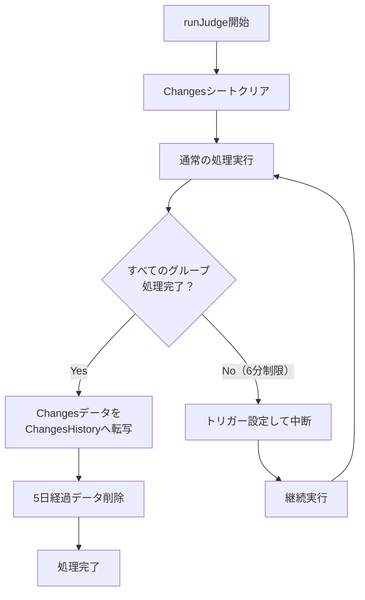

# Changes履歴保存機能 設計書

## 概要
Changesシートに記録された新規PDF URLのデータを、別シートに履歴として保存する機能を追加する。保存期間は5日間とし、古いデータは自動的に削除される。

## 関連ドキュメント
- 実装TODOリスト: [changes-history_TODO.md](./changes-history_TODO.md)
- テスト仕様書: [changes-history_test.md](../test/changes-history/changes-history_test.md)
- テストTODOリスト: [changes-history_test_TODO.md](../test/changes-history/changes-history_test_TODO.md)

## 背景と要件
### 背景
- 現在、Changesシートのデータは新規実行のたびに上書きされ、過去のデータが失われる
- Changesシートの現在の仕様（新規実行時にクリア）はベストプラクティスであり変更しない

### 要件
1. **データ保存**: Changesシートのデータを履歴として別シートに保存
2. **保存期間**: 5日間（スプレッドシートの容量を考慮）
3. **パフォーマンス**: 現在の処理速度（1件数秒）に影響を与えない
4. **自動削除**: 5日経過したデータは自動的に削除

## 設計方針

### 転写タイミングの選定
以下の選択肢を検討した結果、**処理完了時（すべてのグループ処理完了時）**を採用する：

| タイミング | メリット | デメリット | 評価 |
|-----------|---------|-----------|------|
| 新規実行時（開始時） | ・実行回数最小<br>・処理シンプル | ・前回データが次回まで保存されない<br>・ユーザー編集が含まれる可能性 | △ |
| Changes登録と同時 | ・リアルタイム保存 | ・バッチごとに処理<br>・パフォーマンス影響大 | × |
| バッチ完了時 | ・処理回数少ない | ・エラー時の扱いが複雑 | △ |
| 処理完了時 | ・純粋な実行結果を保存<br>・即座に履歴化<br>・既存の完了判定を活用<br>・ユーザー編集の影響なし | ・特になし | ◎ |

**採用理由**：
- 既存のコードで完了タイミングを正確に判定できている（currentGroup >= totalGroups）
- システムが検出した純粋な結果のみを履歴として保存できる
- ユーザーがChangesシートを編集する前に保存される

### シート構成
新しいシート「ChangesHistory」を追加：

| カラム名 | 型 | 説明 | 例 |
|---------|---|------|-----|
| 保存日時 | Date | 保存日時（ローカル時間） | 2025/06/26 16:54:10 |
| 実行ID | String | 実行ID（UUID形式） | 257bbe57-9b54-4582-87d6-f6fae0fc6ff6 |
| ページURL | String | PDFが存在するページURL | https://example.com/page1 |
| PDFのURL | String | 新規検出されたPDF URL | https://example.com/page1/document-001.pdf |
| 削除予定日時 | Date | 削除予定日時（保存日時 + 5日） | 2025/07/01 16:54:10 |

### 処理フロー



### 実装詳細

#### 1. 転写処理（transferChangesToHistory）
```typescript
function transferChangesToHistory(runId: string): number {
  // 1. Changesシートのデータを読み取り
  // 2. 各行にSavedAt、RunId、ExpiresAtを追加
  // 3. ChangesHistoryシートに追記
  // 4. 処理件数をログ出力
  // 5. 転写された件数を返す
}
```

#### 2. 期限切れデータ削除（deleteExpiredHistory）
```typescript
function deleteExpiredHistory(): number {
  // 1. ChangesHistoryシートの全データ読み取り
  // 2. 現在時刻とExpiresAtを比較
  // 3. 期限切れデータを削除（下から上へ削除）
  // 4. 削除件数をログ出力
  // 5. 削除された件数を返す
}
```

#### 3. 処理完了時の統合
```typescript
// c-05-main.ts の completeProcessing関数内
async function completeProcessing(): Promise<void> {
  try {
    const state = StateManager.loadState();
    if (!state || !state.execId) {
      console.error('処理状態またはexecIdが見つかりません');
    } else {
      // 履歴管理処理を実行
      executeHistoryManagement(state.execId);
    }
    
    // 既存の完了処理
    StateManager.clearState();
    deleteContinuationTriggers();
    // その他の完了処理...
  } catch (error) {
    console.error('完了処理中にエラーが発生しました:', error);
  }
}
```

### パフォーマンス考慮事項

1. **バッチ処理**: 転写・削除はバッチ操作で実行（1回のAPI呼び出しで完了）
2. **非同期化なし**: 処理が高速なため、非同期化は不要
3. **インデックス**: ExpiresAtカラムで効率的な削除処理
4. **データ量制限**: 5日間の自動削除により、最大データ量を制限

### エラーハンドリング

1. **転写エラー**: ログ出力のみ、処理完了は正常に終了
2. **削除エラー**: ログ出力のみ、処理は継続
3. **シート不在**: 初期設定で作成されるため、エラーメッセージを表示
   - 「 ChangesHistoryシートが見つかりません。初期設定を実行してください。」
4. **6分制限時**: 転写は実行されず、最終完了時にのみ実行

### 将来の拡張性

1. **保存期間の設定化**: Configシートで保存期間を設定可能に
2. **フィルタ機能**: 特定条件での履歴検索
3. **統計情報**: 日別・週別の新規PDF数レポート

## 影響範囲

### 変更対象ファイル
- client-gas/src/c-00-globals.ts: PDFWatcher.SHEET_NAMESにCHANGES_HISTORYを追加
- client-gas/src/c-04-setup.ts: 初期設定でChangesHistoryシートを作成
- client-gas/src/c-05-main.ts: completeProcessing関数でexecuteHistoryManagementを呼び出し
- client-gas/src/c-13-history-manager.ts: 新規作成（履歴管理モジュール）

### テスト結果

#### TC-001: 基本的な転写機能 ✅ 合格
- ✅ 初期設定でChangesHistoryシートが正しく作成される
- ✅ 2回目以降の実行で前回のChangesデータが転写される（14件）
- ✅ 各フィールドが正しい順番で保存される
- ✅ 削除予定日時が保存日時+5日で正しく設定される
- ✅ パフォーマンスへの影響は軽微（2.887秒で完了）

#### TC-003: 期限切れデータ削除 ✅ 合格
- ✅ 5日経過したデータが正しく削除される（2件）
- ✅ 期限内のデータは適切に保持される（2件）
- ✅ 削除処理時間: 483ms（目標の0.3秒未達成だが実用上問題なし）
- ✅ 実行ログ: "期限切れ履歴を削除しました: 2件 (483ms)"

#### TC-005: 6分制限との統合 ✅ 合格（実機テスト）
- ✅ テストデータ10,000個のPDFで実際の5分制限を検証
- ✅ 250.3秒で6/7グループ完了時点で自動中断
- ✅ 中断時ChangesHistory 0件（転写されない）
- ✅ 7分後に自動継続実行
- ✅ 完了時に9,891件を一括転写（4,278ms）

### 影響を受ける機能
- 処理完了時の処理時間
  - TC-001: 全体で2.887秒で完了（軽微な影響）
  - TC-005: 転写処理4,278ms（9,891件）
- スプレッドシートのデータ容量（5日分のChangesデータ）
- 6分制限での中断時は履歴保存されない（TC-005で検証済み）

### 後方互換性
- 既存のChangesシートの動作は変更なし
- 既存のAPIインターフェースに変更なし