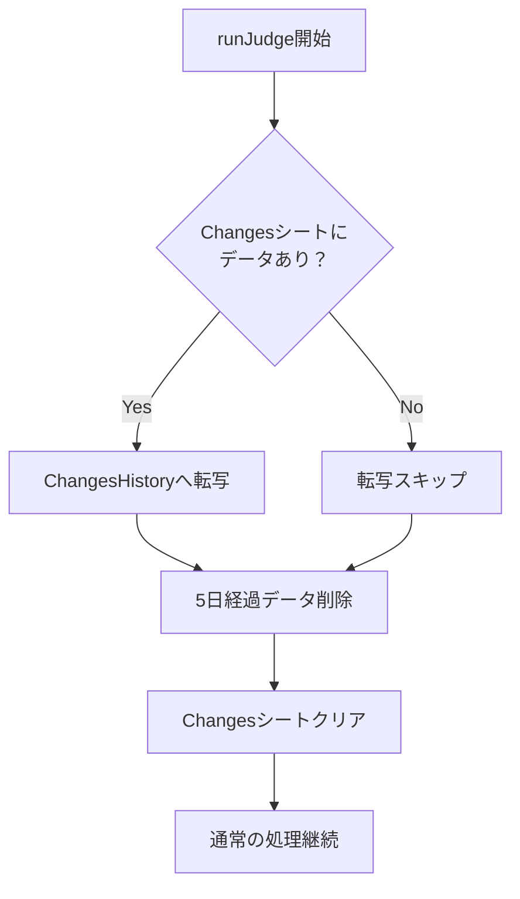

# Changes履歴保存機能 設計書

## 概要
Changesシートに記録された新規PDF URLのデータを、別シートに履歴として保存する機能を追加する。保存期間は5日間とし、古いデータは自動的に削除される。

## 関連ドキュメント
- 実装TODOリスト: [changes-history_TODO.md](./changes-history_TODO.md)
- テスト仕様書: [changes-history_test.md](../test/changes-history/changes-history_test.md)
- テストTODOリスト: [changes-history_test_TODO.md](../test/changes-history/changes-history_test_TODO.md)

## 背景と要件
### 背景
- 現在、Changesシートのデータは新規実行のたびに上書きされ、過去のデータが失われる
- Changesシートの現在の仕様（新規実行時にクリア）はベストプラクティスであり変更しない

### 要件
1. **データ保存**: Changesシートのデータを履歴として別シートに保存
2. **保存期間**: 5日間（スプレッドシートの容量を考慮）
3. **パフォーマンス**: 現在の処理速度（1件数秒）に影響を与えない
4. **自動削除**: 5日経過したデータは自動的に削除

## 設計方針

### 転写タイミングの選定
以下の選択肢を検討した結果、**新規実行時（runJudgeの開始時）**を採用する：

| タイミング | メリット | デメリット | 評価 |
|-----------|---------|-----------|------|
| 新規実行時（開始時） | ・実行回数最小<br>・処理シンプル<br>・パフォーマンス影響なし | ・前回データが次回まで保存されない | ◎ |
| Changes登録と同時 | ・リアルタイム保存 | ・バッチごとに処理<br>・パフォーマンス影響大 | × |
| バッチ完了時 | ・処理回数少ない | ・エラー時の扱いが複雑 | △ |
| runJudge完了時 | ・全データまとめて保存 | ・6分制限での中断時の扱いが複雑 | △ |

### シート構成
新しいシート「ChangesHistory」を追加：

| カラム名 | 型 | 説明 | 例 |
|---------|---|------|-----|
| SavedAt | Date | 保存日時（UTC） | 2025-06-26T10:30:00Z |
| RunId | String | 実行ID | run_12345 |
| PdfUrl | String | 新規検出されたPDF URL | https://example.com/doc.pdf |
| PageUrl | String | PDFが存在するページURL | https://example.com/page |
| ExpiresAt | Date | 削除予定日時（SavedAt + 5日） | 2025-07-01T10:30:00Z |

### 処理フロー



### 実装詳細

#### 1. 転写処理（transferChangesToHistory）
```typescript
function transferChangesToHistory(): void {
  // 1. Changesシートのデータを読み取り
  // 2. 各行にSavedAt、RunId、ExpiresAtを追加
  // 3. ChangesHistoryシートに追記
  // 4. 処理件数をログ出力
}
```

#### 2. 期限切れデータ削除（deleteExpiredHistory）
```typescript
function deleteExpiredHistory(): void {
  // 1. ChangesHistoryシートの全データ読み取り
  // 2. 現在時刻とExpiresAtを比較
  // 3. 期限切れデータを削除（バッチ削除で高速化）
  // 4. 削除件数をログ出力
}
```

#### 3. runJudgeへの統合
```typescript
function runJudge(): void {
  // 新規追加処理
  transferChangesToHistory();
  deleteExpiredHistory();
  
  // 既存処理
  clearChangesSheet();
  // ...以降の処理
}
```

### パフォーマンス考慮事項

1. **バッチ処理**: 転写・削除はバッチ操作で実行（1回のAPI呼び出しで完了）
2. **非同期化なし**: 処理が高速なため、非同期化は不要
3. **インデックス**: ExpiresAtカラムで効率的な削除処理
4. **データ量制限**: 5日間の自動削除により、最大データ量を制限

### エラーハンドリング

1. **転写エラー**: ログ出力のみ、処理は継続（Changesクリアは実行）
2. **削除エラー**: ログ出力のみ、処理は継続
3. **シート不在**: 自動作成機能を実装

### 将来の拡張性

1. **保存期間の設定化**: Configシートで保存期間を設定可能に
2. **フィルタ機能**: 特定条件での履歴検索
3. **統計情報**: 日別・週別の新規PDF数レポート

## 影響範囲

### 変更対象ファイル
- client-gas/src/c-05-main.ts: runJudge関数の修正
- client-gas/src/c-13-history-manager.ts: 新規作成（履歴管理モジュール）

### 影響を受ける機能
- runJudge実行時の初期処理時間（+0.5秒程度）
- スプレッドシートのデータ容量（5日分のChangesデータ）

### 後方互換性
- 既存のChangesシートの動作は変更なし
- 既存のAPIインターフェースに変更なし